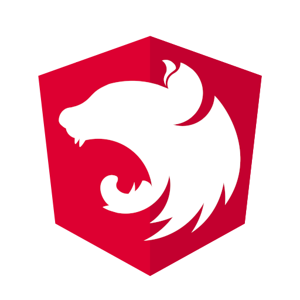

# The bug free lamp sample.

> Please star this repo if you like ⭐ <br>
> It's motivates me a lot!

## Stack

  <a href="https://www.typescriptlang.org/"></a>
  <a href="https://nestjs.com/"></a>
  <a href="https://www.docker.com/"></a>


## Installation
```bash
$ npm install
```

## Running the app

```bash
# development
$ npm run start
# watch mode
$ npm run start:dev
# production mode
$ npm run start:prod
```

## Test

```bash
# unit tests
$ npm run test
# e2e tests
$ npm run test:e2e
# test coverage
$ npm run test:cov
```

## Authors

* **[Ruslan Shvetsov](https://github.com/developer01234)**
* See also the list of **[contributors](https://github.com/developer01234/bug-free-lamp/graphs/contributors)** who participated in this project.

## Contributing

Please read **[CONTRIBUTING](CONTRIBUTING.md)** for details on our code of conduct, and the process for submitting pull requests to us.

## License

**[CC0 License](LICENSE).**
